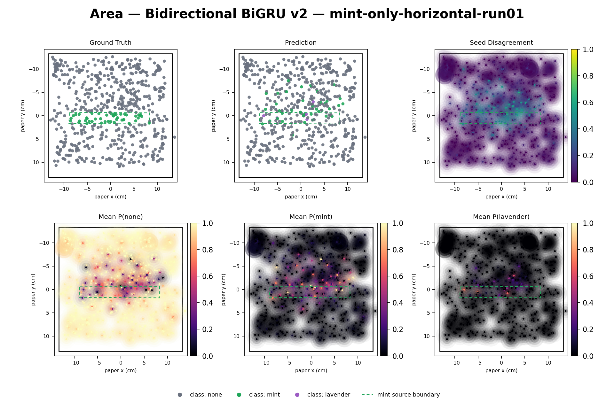
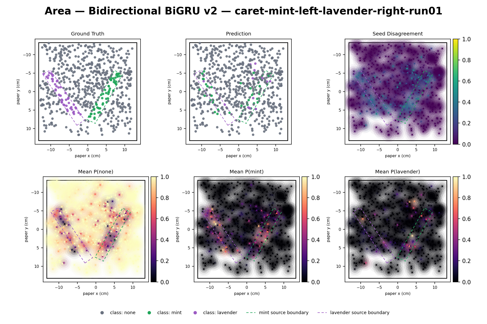
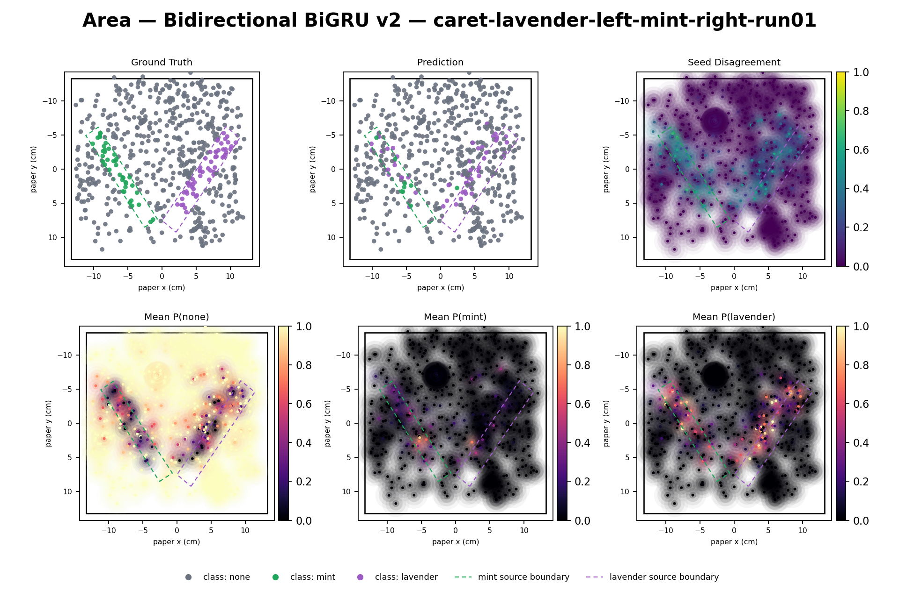
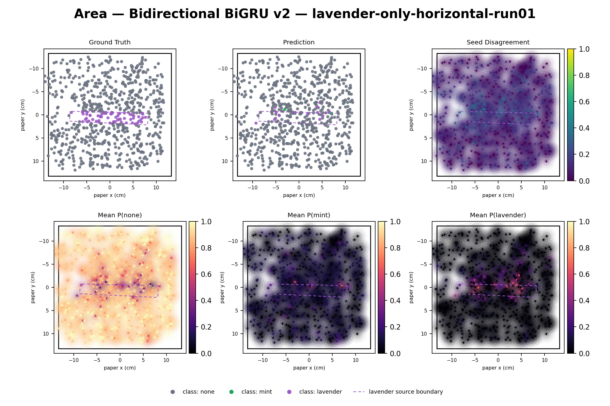
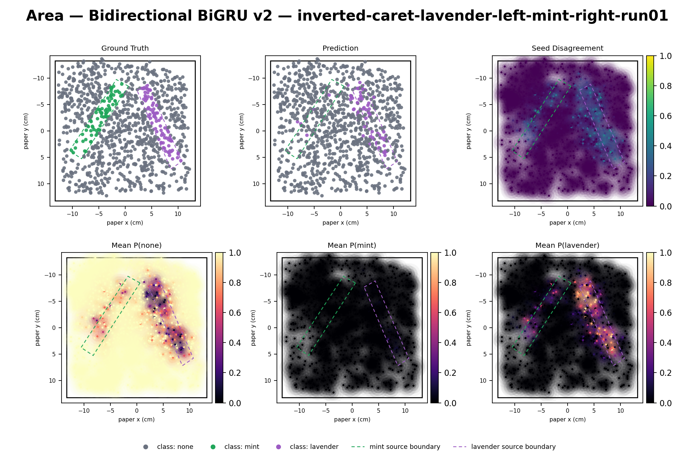

# Bidirectional GRU vs. bidirectional Temporal CNN -- LOSO area, July 30 sessions

> Held-out-session validation, not an independent test: each fold's held-out session selects and reports its own best checkpoint (same convention as the existing LOSO study).

## Parameter counts

| Model | Parameters | Learning rate |
|---|---:|---:|
| Existing bidirectional Temporal CNN (area head) | 254,787 | 1e-4 (unchanged) |
| BiGRU v1 (hidden=64, no dropout/norm) | 65,763 | 1e-4 (unchanged, isolates one variable) |
| **BiGRU v2 (hidden=161, +dropout, +LayerNorm)** | **254,975** | **0.001 (chosen via a 4-candidate probe on one fold)** |

## Main comparison: macro-F1 per held-out session (5-seed mean +/- SD)

| Held-out session | TCN (existing) | BiGRU v1 | BiGRU v2 |
|---|---:|---:|---:|
| mint-only-horizontal-run01 | 0.6194 +/- 0.0182 | 0.3224 +/- 0.0020 | 0.4131 +/- 0.0097 |
| caret-mint-left-lavender-right-run01 | 0.4980 +/- 0.0135 | 0.3176 +/- 0.0023 | 0.4272 +/- 0.0119 |
| caret-lavender-left-mint-right-run01 | 0.6368 +/- 0.0155 | 0.3574 +/- 0.0036 | 0.5329 +/- 0.0211 |
| lavender-only-horizontal-run01 | 0.5623 +/- 0.0656 | 0.3363 +/- 0.0134 | 0.3767 +/- 0.0117 |
| inverted-caret-lavender-left-mint-right-run01 | 0.5038 +/- 0.0223 | 0.3630 +/- 0.0087 | 0.4773 +/- 0.0135 |
| **Equal-session summary** | **0.5641 +/- 0.0099** | **0.3393 +/- 0.0182** | **0.4455 +/- 0.0543** |

TCN column is quoted unchanged from `analysis/reports/spatial-sequence/leave-one-session-out/report.md`; not re-run for this comparison (explicit scope decision). SD for equal-session summaries is the SD of the 5 per-session means, matching how the existing report's own SD is computed.

## Spatial diagnostics (ground truth / prediction / disagreement / class probabilities)

Identical layout/rendering to the existing TCN figures -- generated by calling `analysis.spatial_sequence.visualization.render_cross_seed_diagnostics` unchanged (see `analysis/gru_sequence/figures.py`), not a reimplementation. Compare against `analysis/reports/spatial-sequence/leave-one-session-out/figures/area_bidirectional_tcnn_<session>.png`.

## v1 full per-session breakdown

### mint-only-horizontal-run01

5-seed accuracy: 0.8129 +/- 0.0951 | 5-seed macro-F1: 0.3224 +/- 0.0020 | per-seed macro-F1: [0.322, 0.323, 0.326, 0.3205, 0.3205]

Majority-vote-across-seeds confusion matrix (n=619): accuracy 0.7819, balanced accuracy 0.4923, macro-F1 0.4850, present classes: none, mint

| truth \ predicted | none | mint | lavender |
|---|---:|---:|---:|
| **none** | 477 | 96 | 0 |
| **mint** | 39 | 7 | 0 |
| **lavender** | 0 | 0 | 0 |

| Class | Precision | Recall | F1 | Support |
|---|---:|---:|---:|---:|
| none | 0.9244 | 0.8325 | 0.8760 | 573 |
| mint | 0.0680 | 0.1522 | 0.0940 | 46 |
| lavender | -- | -- | -- | 0 (not present in this session) |

### caret-mint-left-lavender-right-run01

5-seed accuracy: 0.8287 +/- 0.0235 | 5-seed macro-F1: 0.3176 +/- 0.0023 | per-seed macro-F1: [0.3178, 0.3197, 0.3141, 0.3159, 0.3204]

Majority-vote-across-seeds confusion matrix (n=676): accuracy 0.8432, balanced accuracy 0.3365, macro-F1 0.3159, present classes: none, mint, lavender

| truth \ predicted | none | mint | lavender |
|---|---:|---:|---:|
| **none** | 569 | 5 | 0 |
| **mint** | 54 | 1 | 0 |
| **lavender** | 47 | 0 | 0 |

| Class | Precision | Recall | F1 | Support |
|---|---:|---:|---:|---:|
| none | 0.8493 | 0.9913 | 0.9148 | 574 |
| mint | 0.1667 | 0.0182 | 0.0328 | 55 |
| lavender | 0.0000 | 0.0000 | 0.0000 | 47 |

### caret-lavender-left-mint-right-run01

5-seed accuracy: 0.8372 +/- 0.0037 | 5-seed macro-F1: 0.3574 +/- 0.0036 | per-seed macro-F1: [0.3556, 0.3569, 0.355, 0.3552, 0.3644]

Majority-vote-across-seeds confusion matrix (n=619): accuracy 0.8401, balanced accuracy 0.3686, macro-F1 0.3634, present classes: none, mint, lavender

| truth \ predicted | none | mint | lavender |
|---|---:|---:|---:|
| **none** | 513 | 0 | 10 |
| **mint** | 31 | 0 | 9 |
| **lavender** | 49 | 0 | 7 |

| Class | Precision | Recall | F1 | Support |
|---|---:|---:|---:|---:|
| none | 0.8651 | 0.9809 | 0.9194 | 523 |
| mint | 0.0000 | 0.0000 | 0.0000 | 40 |
| lavender | 0.2692 | 0.1250 | 0.1707 | 56 |

### lavender-only-horizontal-run01

5-seed accuracy: 0.8853 +/- 0.0394 | 5-seed macro-F1: 0.3363 +/- 0.0134 | per-seed macro-F1: [0.3185, 0.3317, 0.3464, 0.3288, 0.3562]

Majority-vote-across-seeds confusion matrix (n=715): accuracy 0.9147, balanced accuracy 0.5000, macro-F1 0.4777, present classes: none, lavender

| truth \ predicted | none | mint | lavender |
|---|---:|---:|---:|
| **none** | 654 | 0 | 0 |
| **mint** | 0 | 0 | 0 |
| **lavender** | 61 | 0 | 0 |

| Class | Precision | Recall | F1 | Support |
|---|---:|---:|---:|---:|
| none | 0.9147 | 1.0000 | 0.9554 | 654 |
| mint | -- | -- | -- | 0 (not present in this session) |
| lavender | 0.0000 | 0.0000 | 0.0000 | 61 |

### inverted-caret-lavender-left-mint-right-run01

5-seed accuracy: 0.8525 +/- 0.0013 | 5-seed macro-F1: 0.3630 +/- 0.0087 | per-seed macro-F1: [0.3555, 0.3649, 0.3507, 0.374, 0.3699]

Majority-vote-across-seeds confusion matrix (n=1036): accuracy 0.8523, balanced accuracy 0.3606, macro-F1 0.3569, present classes: none, mint, lavender

| truth \ predicted | none | mint | lavender |
|---|---:|---:|---:|
| **none** | 876 | 0 | 8 |
| **mint** | 74 | 0 | 1 |
| **lavender** | 70 | 0 | 7 |

| Class | Precision | Recall | F1 | Support |
|---|---:|---:|---:|---:|
| none | 0.8588 | 0.9910 | 0.9202 | 884 |
| mint | 0.0000 | 0.0000 | 0.0000 | 75 |
| lavender | 0.4375 | 0.0909 | 0.1505 | 77 |

## v2 full per-session breakdown

### mint-only-horizontal-run01

5-seed accuracy: 0.9005 +/- 0.0033 | 5-seed macro-F1: 0.4131 +/- 0.0097 | per-seed macro-F1: [0.4164, 0.4164, 0.4191, 0.4199, 0.3938]

Majority-vote-across-seeds confusion matrix (n=619): accuracy 0.8982, balanced accuracy 0.5951, macro-F1 0.6053, present classes: none, mint

| truth \ predicted | none | mint | lavender |
|---|---:|---:|---:|
| **none** | 545 | 27 | 1 |
| **mint** | 31 | 11 | 4 |
| **lavender** | 0 | 0 | 0 |

| Class | Precision | Recall | F1 | Support |
|---|---:|---:|---:|---:|
| none | 0.9462 | 0.9511 | 0.9487 | 573 |
| mint | 0.2895 | 0.2391 | 0.2619 | 46 |
| lavender | -- | -- | -- | 0 (not present in this session) |

### caret-mint-left-lavender-right-run01

5-seed accuracy: 0.8423 +/- 0.0040 | 5-seed macro-F1: 0.4272 +/- 0.0119 | per-seed macro-F1: [0.4378, 0.4108, 0.4272, 0.4179, 0.4426]

Majority-vote-across-seeds confusion matrix (n=676): accuracy 0.8432, balanced accuracy 0.4043, macro-F1 0.4140, present classes: none, mint, lavender

| truth \ predicted | none | mint | lavender |
|---|---:|---:|---:|
| **none** | 557 | 11 | 6 |
| **mint** | 39 | 11 | 5 |
| **lavender** | 34 | 11 | 2 |

| Class | Precision | Recall | F1 | Support |
|---|---:|---:|---:|---:|
| none | 0.8841 | 0.9704 | 0.9252 | 574 |
| mint | 0.3333 | 0.2000 | 0.2500 | 55 |
| lavender | 0.1538 | 0.0426 | 0.0667 | 47 |

### caret-lavender-left-mint-right-run01

5-seed accuracy: 0.8439 +/- 0.0082 | 5-seed macro-F1: 0.5329 +/- 0.0211 | per-seed macro-F1: [0.5133, 0.5173, 0.5602, 0.5163, 0.5571]

Majority-vote-across-seeds confusion matrix (n=619): accuracy 0.8546, balanced accuracy 0.5157, macro-F1 0.5470, present classes: none, mint, lavender

| truth \ predicted | none | mint | lavender |
|---|---:|---:|---:|
| **none** | 499 | 1 | 23 |
| **mint** | 19 | 8 | 13 |
| **lavender** | 34 | 0 | 22 |

| Class | Precision | Recall | F1 | Support |
|---|---:|---:|---:|---:|
| none | 0.9040 | 0.9541 | 0.9284 | 523 |
| mint | 0.8889 | 0.2000 | 0.3265 | 40 |
| lavender | 0.3793 | 0.3929 | 0.3860 | 56 |

### lavender-only-horizontal-run01

5-seed accuracy: 0.9071 +/- 0.0054 | 5-seed macro-F1: 0.3767 +/- 0.0117 | per-seed macro-F1: [0.3847, 0.3621, 0.3944, 0.3677, 0.3746]

Majority-vote-across-seeds confusion matrix (n=715): accuracy 0.9147, balanced accuracy 0.5520, macro-F1 0.5728, present classes: none, lavender

| truth \ predicted | none | mint | lavender |
|---|---:|---:|---:|
| **none** | 647 | 1 | 6 |
| **mint** | 0 | 0 | 0 |
| **lavender** | 52 | 2 | 7 |

| Class | Precision | Recall | F1 | Support |
|---|---:|---:|---:|---:|
| none | 0.9256 | 0.9893 | 0.9564 | 654 |
| mint | -- | -- | -- | 0 (not present in this session) |
| lavender | 0.5385 | 0.1148 | 0.1892 | 61 |

### inverted-caret-lavender-left-mint-right-run01

5-seed accuracy: 0.8637 +/- 0.0049 | 5-seed macro-F1: 0.4773 +/- 0.0135 | per-seed macro-F1: [0.4793, 0.4644, 0.4908, 0.4595, 0.4927]

Majority-vote-across-seeds confusion matrix (n=1036): accuracy 0.8649, balanced accuracy 0.4762, macro-F1 0.4779, present classes: none, mint, lavender

| truth \ predicted | none | mint | lavender |
|---|---:|---:|---:|
| **none** | 861 | 0 | 23 |
| **mint** | 72 | 0 | 3 |
| **lavender** | 42 | 0 | 35 |

| Class | Precision | Recall | F1 | Support |
|---|---:|---:|---:|---:|
| none | 0.8831 | 0.9740 | 0.9263 | 884 |
| mint | 0.0000 | 0.0000 | 0.0000 | 75 |
| lavender | 0.5738 | 0.4545 | 0.5072 | 77 |

