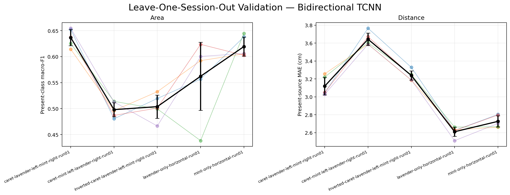
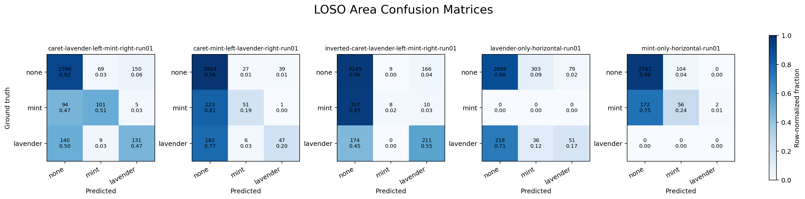
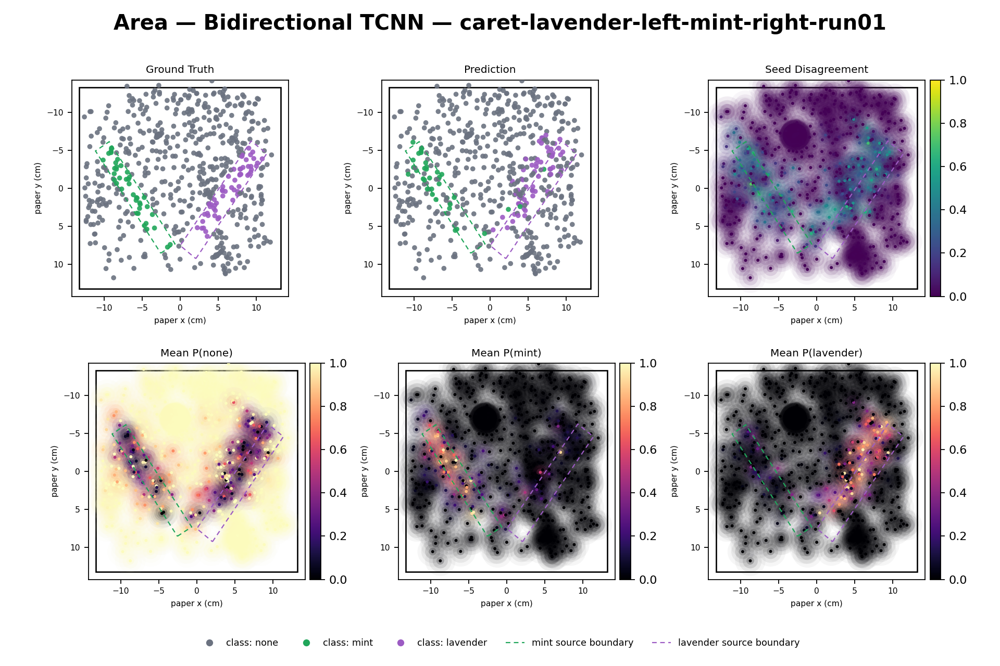
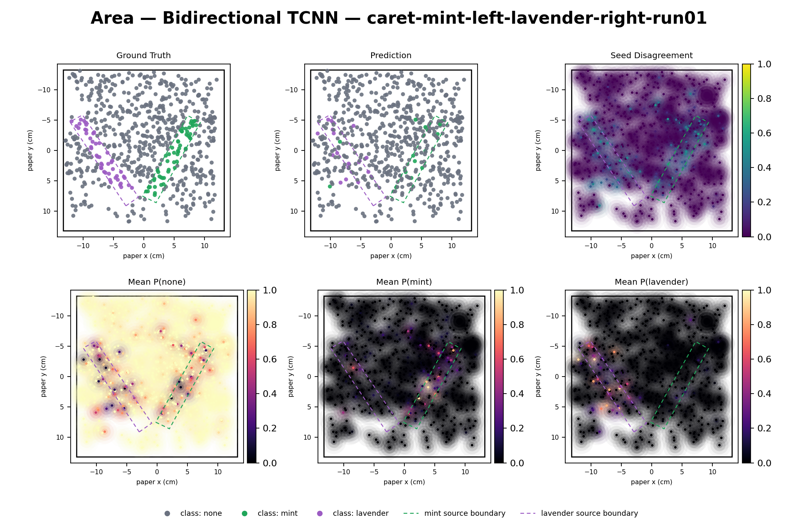
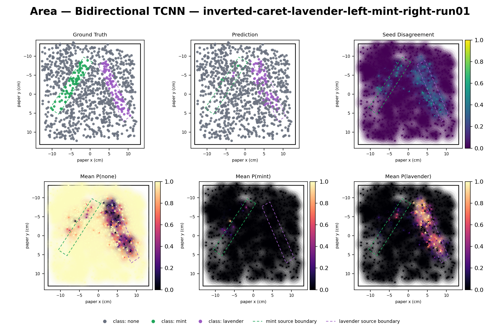
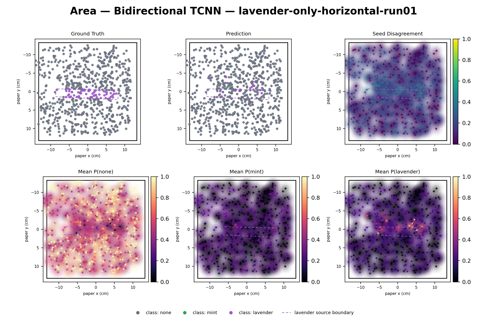
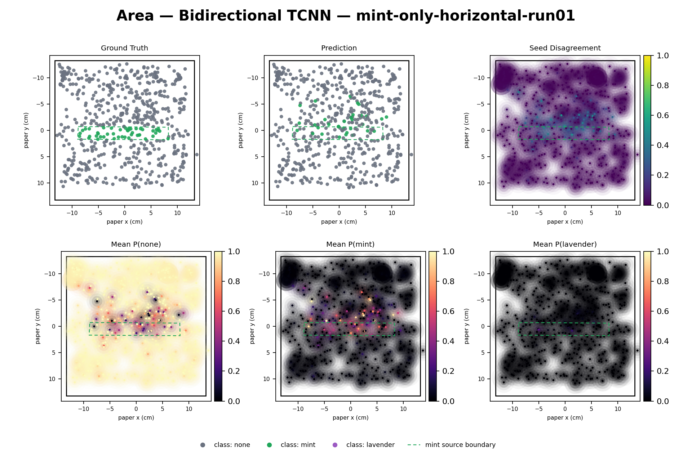

# Leave-One-Session-Out Validation

> Cross-session validation, not an independent test: each held-out session selects and reports its fold's best checkpoint.

Each fold trains on every annotated row from four sessions and validates on every full-context anchor from the fifth. Input and target statistics use each training physical row exactly once. Models are the unchanged length-24 bidirectional Temporal CNN.

## Area spatial diagnostics

Each held-out session is shown separately. Prediction is the per-anchor majority vote across seeds 0-4; class probabilities are arithmetic means and disagreement is the mean pairwise probability difference.

| Task | Held-out session | Main metric mean ± SD | Median best epoch |
|---|---|---:|---:|
| area | caret-lavender-left-mint-right-run01 | 0.6368 ± 0.0155 | 34.0 |
| area | caret-mint-left-lavender-right-run01 | 0.4980 ± 0.0135 | 54.0 |
| area | inverted-caret-lavender-left-mint-right-run01 | 0.5038 ± 0.0223 | 34.0 |
| area | lavender-only-horizontal-run01 | 0.5623 ± 0.0656 | 12.0 |
| area | mint-only-horizontal-run01 | 0.6194 ± 0.0182 | 22.0 |
| area | **Equal-session summary** | **0.5641 ± 0.0099** | — |
| distance | caret-lavender-left-mint-right-run01 | 3.1200 ± 0.0978 | 11.0 |
| distance | caret-mint-left-lavender-right-run01 | 3.6432 ± 0.0686 | 21.0 |
| distance | inverted-caret-lavender-left-mint-right-run01 | 3.2384 ± 0.0521 | 53.0 |
| distance | lavender-only-horizontal-run01 | 2.6109 ± 0.0518 | 17.0 |
| distance | mint-only-horizontal-run01 | 2.7266 ± 0.0623 | 18.0 |
| distance | **Equal-session summary** | **3.0678 ± 0.0358** | — |

## Interpretation

The equal-session LOSO area macro-F1 is 0.5641, 0.0888 lower than the canonical within-session length-24 value (0.6528). LOSO distance MAE is 3.0678 cm, 0.5447 cm higher than the within-session value (2.5232 cm). These gaps are descriptive rather than paired test effects: LOSO scores an entire held-out session, while the canonical protocol scores centered within-session anchors.

Generalization varies substantially by session. Area is strongest when holding out caret-lavender-left-mint-right and weakest for the swapped-caret and inverted-caret layouts. The confusion matrices show why: `none` recall stays high, but odor-class recall often collapses toward `none`—especially mint in the inverted-caret fold and both odor classes in the swapped-caret fold. Macro-F1 exposes this failure despite high overall accuracy.

Distance transfers better than area but remains systematically worse than within-session validation. The parity plots show compressed predictions: near-source distances are often overestimated and large distances underestimated. The swapped-caret session is the hardest distance fold; the two single-source sessions are easier, although they exercise only one output head.

Because the held-out session selects its own best epoch, this is cross-session validation—not an independent test estimate. A future deployment estimate needs another untouched session or a nested selection protocol.

Distance parity figures retain all five seed predictions and omit absent-source heads in single-source sessions. No significance tests are performed.
