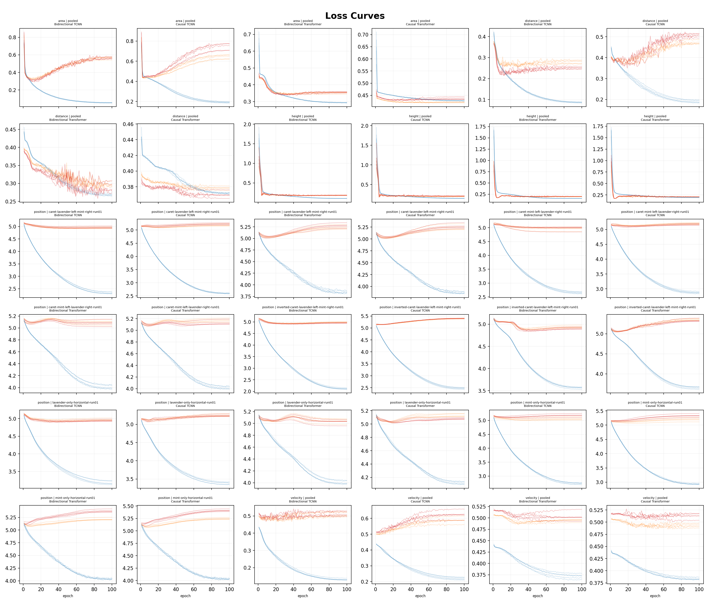
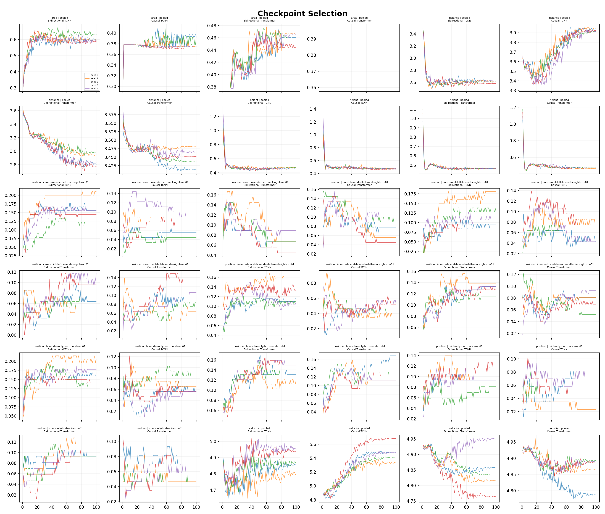
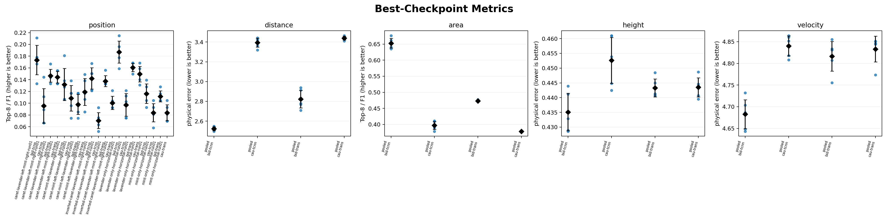
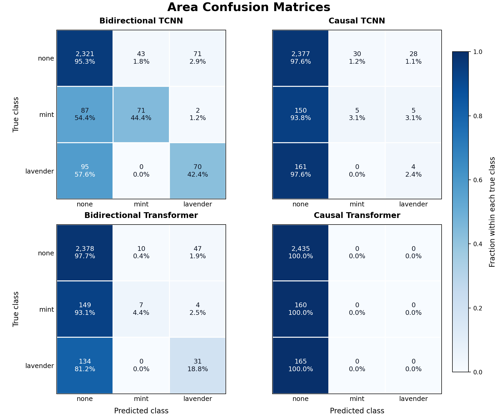

# Spatial Sequence: Joint Position and Anchor Evaluation

> Exploratory validation only. Checkpoints were selected on the same anchor validation rows reported below. There is no independent test set and no deployment-performance claim.

## Protocol

The pipeline uses a centered Train-Guard-Validation-Guard-Train split, dense 24-token training, and one formal prediction per shared physical anchor row. Causal models score token 23 from t-23...t; bidirectional models score token 12 from t-12...t+11. Every physical training row contributes once to normalization, and validation rows do not contribute. Position is a paper-only 13x13 joint classification target; paper-exterior position labels are masked.

The table reports five-seed mean +/- population SD. Every point from seeds 0-4 is retained in the figures; no significance tests were performed.

## Five-seed summaries

| Target | Session | Architecture | Mode | Selection metric mean +/- SD | Convergence |
|---|---|---|---|---:|---|
| area | pooled | temporal-cnn | bidirectional | anchor_equal_session_macro_f1: 0.6528 +/- 0.0148 | mixed/plateau |
| area | pooled | temporal-cnn | causal | anchor_equal_session_macro_f1: 0.3968 +/- 0.0122 | mixed/plateau |
| area | pooled | transformer | bidirectional | anchor_equal_session_macro_f1: 0.4734 +/- 0.0028 | mixed/plateau |
| area | pooled | transformer | causal | anchor_equal_session_macro_f1: 0.3782 +/- 0.0000 | mixed/plateau |
| distance | pooled | temporal-cnn | bidirectional | anchor_equal_session_present_source_mae_cm: 2.5232 +/- 0.0187 | mixed/plateau |
| distance | pooled | temporal-cnn | causal | anchor_equal_session_present_source_mae_cm: 3.3944 +/- 0.0460 | mixed/plateau |
| distance | pooled | transformer | bidirectional | anchor_equal_session_present_source_mae_cm: 2.8214 +/- 0.0885 | mixed/plateau |
| distance | pooled | transformer | causal | anchor_equal_session_present_source_mae_cm: 3.4399 +/- 0.0177 | mixed/plateau |
| height | pooled | temporal-cnn | bidirectional | anchor_equal_session_mae_cm: 0.4351 +/- 0.0063 | mixed/plateau |
| height | pooled | temporal-cnn | causal | anchor_equal_session_mae_cm: 0.4526 +/- 0.0078 | mixed/plateau |
| height | pooled | transformer | bidirectional | anchor_equal_session_mae_cm: 0.4433 +/- 0.0030 | mixed/plateau |
| height | pooled | transformer | causal | anchor_equal_session_mae_cm: 0.4435 +/- 0.0032 | fast-overfit |
| position | caret-lavender-left-mint-right-run01 | temporal-cnn | bidirectional | anchor_top_8: 0.1733 +/- 0.0249 | mixed/plateau |
| position | caret-lavender-left-mint-right-run01 | temporal-cnn | causal | anchor_top_8: 0.0956 +/- 0.0295 | mixed/plateau |
| position | caret-lavender-left-mint-right-run01 | transformer | bidirectional | anchor_top_8: 0.1467 +/- 0.0109 | fast-overfit |
| position | caret-lavender-left-mint-right-run01 | transformer | causal | anchor_top_8: 0.1444 +/- 0.0099 | fast-overfit |
| position | caret-mint-left-lavender-right-run01 | temporal-cnn | bidirectional | anchor_top_8: 0.1319 +/- 0.0274 | mixed/plateau |
| position | caret-mint-left-lavender-right-run01 | temporal-cnn | causal | anchor_top_8: 0.1085 +/- 0.0217 | fast-overfit |
| position | caret-mint-left-lavender-right-run01 | transformer | bidirectional | anchor_top_8: 0.0979 +/- 0.0170 | mixed/plateau |
| position | caret-mint-left-lavender-right-run01 | transformer | causal | anchor_top_8: 0.1191 +/- 0.0227 | mixed/plateau |
| position | inverted-caret-lavender-left-mint-right-run01 | temporal-cnn | bidirectional | anchor_top_8: 0.1422 +/- 0.0181 | mixed/plateau |
| position | inverted-caret-lavender-left-mint-right-run01 | temporal-cnn | causal | anchor_top_8: 0.0705 +/- 0.0134 | mixed/plateau |
| position | inverted-caret-lavender-left-mint-right-run01 | transformer | bidirectional | anchor_top_8: 0.1376 +/- 0.0092 | mixed/plateau |
| position | inverted-caret-lavender-left-mint-right-run01 | transformer | causal | anchor_top_8: 0.1006 +/- 0.0113 | mixed/plateau |
| position | lavender-only-horizontal-run01 | temporal-cnn | bidirectional | anchor_top_8: 0.1869 +/- 0.0187 | mixed/plateau |
| position | lavender-only-horizontal-run01 | temporal-cnn | causal | anchor_top_8: 0.0972 +/- 0.0192 | mixed/plateau |
| position | lavender-only-horizontal-run01 | transformer | bidirectional | anchor_top_8: 0.1607 +/- 0.0070 | mixed/plateau |
| position | lavender-only-horizontal-run01 | transformer | causal | anchor_top_8: 0.1495 +/- 0.0132 | mixed/plateau |
| position | mint-only-horizontal-run01 | temporal-cnn | bidirectional | anchor_top_8: 0.1163 +/- 0.0164 | mixed/plateau |
| position | mint-only-horizontal-run01 | temporal-cnn | causal | anchor_top_8: 0.0837 +/- 0.0154 | fast-overfit |
| position | mint-only-horizontal-run01 | transformer | bidirectional | anchor_top_8: 0.1116 +/- 0.0093 | mixed/plateau |
| position | mint-only-horizontal-run01 | transformer | causal | anchor_top_8: 0.0837 +/- 0.0136 | mixed/plateau |
| velocity | pooled | temporal-cnn | bidirectional | anchor_equal_session_mean_vector_error_cm_s: 4.6827 +/- 0.0335 | mixed/plateau |
| velocity | pooled | temporal-cnn | causal | anchor_equal_session_mean_vector_error_cm_s: 4.8404 +/- 0.0230 | fast-overfit |
| velocity | pooled | transformer | bidirectional | anchor_equal_session_mean_vector_error_cm_s: 4.8165 +/- 0.0341 | mixed/plateau |
| velocity | pooled | transformer | causal | anchor_equal_session_mean_vector_error_cm_s: 4.8331 +/- 0.0299 | mixed/plateau |

## Main findings

Across all five targets, the bidirectional Temporal CNN has the best mean task-specific selection metric. Its advantage over its causal counterpart is large for position, distance, and area, modest for velocity, and small for height. This architecture-by-mode interaction suggests that access to the recovery side of the smell sequence is more important than backbone family alone; bidirectional results are offline smoothing results and should not be interpreted as online localization performance.

| Architecture | Mode | Position session-mean Top-8 | Distance session-equal MAE (cm) | Area session-equal macro-F1 | Height session-equal MAE (cm) | Velocity session-equal vector error (cm/s) |
|---|---|---:|---:|---:|---:|---:|
| transformer | causal | 0.1195 +/- 0.0043 | 3.4399 +/- 0.0177 | 0.3782 +/- 0.0000 | 0.4435 +/- 0.0032 | 4.8331 +/- 0.0299 |
| transformer | bidirectional | 0.1309 +/- 0.0043 | 2.8214 +/- 0.0885 | 0.4734 +/- 0.0028 | 0.4433 +/- 0.0030 | 4.8165 +/- 0.0341 |
| temporal-cnn | causal | 0.0911 +/- 0.0121 | 3.3944 +/- 0.0460 | 0.3968 +/- 0.0122 | 0.4526 +/- 0.0078 | 4.8404 +/- 0.0230 |
| temporal-cnn | bidirectional | 0.1501 +/- 0.0170 | 2.5232 +/- 0.0187 | 0.6528 +/- 0.0148 | 0.4351 +/- 0.0063 | 4.6827 +/- 0.0335 |

Position remains difficult: even the best overall combination produces a session-equal Top-8 around 0.15, while expected-coordinate errors remain near 8 cm. Expected-coordinate errors vary much less than Top-k or MAP errors, consistent with broad distributions whose probability centroids contract toward the paper center. The direct joint head removes the old factorization artifact, but it does not by itself make the distributions sharp or spatially calibrated.

Area accuracy is high for every model because `none` is common; macro-F1 is therefore the more informative measure. Distance benefits strongly from future context. Height differences are small and RMSE is much larger than MAE, suggesting a mostly easy target with a smaller number of large errors. Velocity improves only modestly and remains the weakest pooled regression target in physical units.

## Convergence and overfitting analysis

Across 180 seeds, the best epoch ranges from 1 to 100 with median 30.5; 67 runs select epoch 20 or earlier and 4 select epoch 90 or later. Seed-level labels are: 43 fast-overfit, 10 still-improving, and 127 plateau.

6 logical configurations meet the at-least-three-of-five fast-overfit rule: height / pooled / transformer / causal; position / caret-lavender-left-mint-right-run01 / transformer / bidirectional; position / caret-lavender-left-mint-right-run01 / transformer / causal; position / caret-mint-left-lavender-right-run01 / temporal-cnn / causal; position / mint-only-horizontal-run01 / temporal-cnn / causal; velocity / pooled / temporal-cnn / causal.

No logical configuration is consistently still improving at 100 epochs. Thus 100 epochs is generally long enough for this dataset; the larger issue is early overfit or a long plateau, not systematic under-training. Best-checkpoint selection prevents the late states from being reported, but it does not create an independent estimate because the same anchors select and evaluate the checkpoint.

## Recommended next experiments

1. Add genuinely held-out sessions or trajectories before tuning further. The current validation set is both the checkpoint selector and the reported set.
2. For position, compare spatially structured targets: Gaussian soft labels, distance-aware/optimal-transport loss, or a continuous 2D density head. One-hot CE treats adjacent and opposite bins as equally wrong.
3. Test longer and multi-scale smell-only context. The strong bidirectional advantage is consistent with sensor response/recovery lag; causal deployment may require longer history or an explicit smell-derived dynamics representation.
4. For the fast-overfit groups, test shorter schedules, stronger weight decay/dropout, and smaller backbones. Early stopping would save computation, but its stopping data must remain separate from the final test data.
5. For area, use class-balanced sampling or loss only as a controlled ablation and continue selecting with present-class session macro-F1. Report calibration and per-class recall alongside F1.
6. Add simple baselines in physical units (session-wise constant, persistence when permitted, and smell-only linear/MLP models) before interpreting the small height and velocity differences as meaningful.

## Position and pooled-task diagnostics

Twenty representative position videos were generated (20 present in this report run). For each logical position configuration, the representative seed is the one whose Top-8 is nearest the five-seed median; ties prefer the smaller seed. Videos show the direct 13x13 joint heatmap and explicitly mark raw-video alignment as approximate.

The 48 pooled-task cross-seed figures use the same physical anchors across seeds. Area and distance diagnostics are split into five session-specific figures per architecture/mode so that each annotated mint/lavender layout is shown independently; height and velocity retain one figure per architecture/mode. Area figures show GT, per-anchor five-seed majority-vote predictions, mean pairwise seed-probability disagreement, and arithmetic-mean class probabilities. A 2-2-1 vote tie is resolved by the higher mean probability among the tied classes, then by the lower class index. Distance figures show cross-seed median predictions, errors, and seed SD. Height uses a shared GT 1st–99th percentile logarithmic physical-height scale for GT and prediction, with out-of-range values saturated, plus a symlog error scale; this prevents the long upper tail from compressing the main range. Velocity uses all anchors for speed color and at most 120 fixed-length arrows for direction. Independent sigma=1 cm glyphs are used for continuous values; no spatial interpolation or sample merging is used.

The 12 additional continuous-task parity scatters retain all five seed predictions as identically styled translucent points. Distance uses separate mint and lavender panels, height uses full-range log-log axes, and velocity compares speed magnitudes. Every panel uses matched ground-truth/prediction limits and only a dashed identity reference; the existing spatial diagnostics remain available for location-conditioned errors and velocity direction.

## Convergence interpretation

A logical configuration is labeled fast-overfit or still-improving only when at least three of five seeds meet the preregistered rule; all other groups are mixed/plateau. The raw loss and selection curves above remain the primary evidence. Seed-level classifications are preserved in `convergence.json`.

## Limits

- Validation anchors selected checkpoints and estimated performance; they are not an independent test set.
- Position models are session-specific. Pooled-task session-equal criteria prevent the longest session from controlling checkpoint selection.
- Raw-frame video alignment is explicitly approximate and is not used for any numerical metric.
- Gaussian glyph diagnostics are renderings of discrete observations, not inferred spatial fields.
