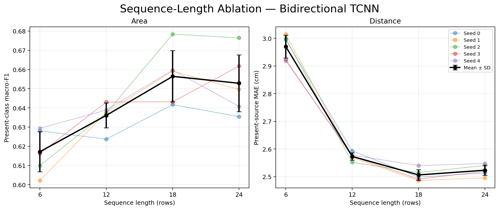
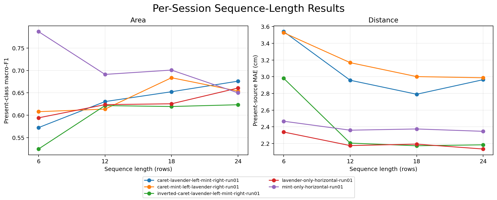
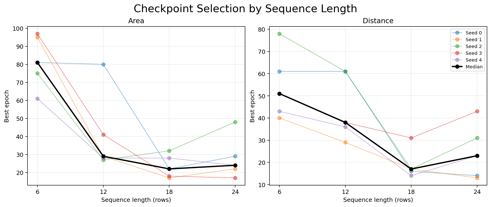

# Sequence-Length Ablation

> Exploratory within-session validation; the same anchors select checkpoints and estimate performance.

Bidirectional Temporal CNN models use the unchanged kernel-5 dilation-1/2/3 backbone. Lengths 6, 12, 18, and 24 share the canonical physical split and validation anchors; every length enumerates all legal training windows. Normalization gives every training physical row one vote.

| Task | Length | Main metric mean ± SD | Mean minus length 24 | Median best epoch |
|---|---:|---:|---:|---:|
| area | 6 | 0.6172 ± 0.0104 | -0.0357 | 81.0 |
| area | 12 | 0.6361 ± 0.0065 | -0.0167 | 29.0 |
| area | 18 | 0.6564 ± 0.0134 | +0.0036 | 22.0 |
| area | 24 | 0.6528 ± 0.0148 | +0.0000 | 24.0 |
| distance | 6 | 2.9702 ± 0.0410 | +0.4471 | 51.0 |
| distance | 12 | 2.5730 ± 0.0134 | +0.0498 | 38.0 |
| distance | 18 | 2.5062 ± 0.0195 | -0.0170 | 17.0 |
| distance | 24 | 2.5232 ± 0.0187 | +0.0000 | 23.0 |

## Per-session means

Each cell averages seeds 0-4. Area is present-class macro-F1; distance is present-source MAE in cm.

| Task | Session | Length 6 | Length 12 | Length 18 | Length 24 |
|---|---|---:|---:|---:|---:|
| area | caret-lavender-left-mint-right-run01 | 0.5724 | 0.6305 | 0.6525 | 0.6761 |
| area | caret-mint-left-lavender-right-run01 | 0.6080 | 0.6137 | 0.6837 | 0.6539 |
| area | inverted-caret-lavender-left-mint-right-run01 | 0.5246 | 0.6215 | 0.6195 | 0.6234 |
| area | lavender-only-horizontal-run01 | 0.5942 | 0.6237 | 0.6256 | 0.6607 |
| area | mint-only-horizontal-run01 | 0.7868 | 0.6912 | 0.7009 | 0.6500 |
| distance | caret-lavender-left-mint-right-run01 | 3.5399 | 2.9574 | 2.7898 | 2.9642 |
| distance | caret-mint-left-lavender-right-run01 | 3.5268 | 3.1680 | 3.0012 | 2.9872 |
| distance | inverted-caret-lavender-left-mint-right-run01 | 2.9805 | 2.2048 | 2.1731 | 2.1844 |
| distance | lavender-only-horizontal-run01 | 2.3373 | 2.1751 | 2.1927 | 2.1341 |
| distance | mint-only-horizontal-run01 | 2.4667 | 2.3595 | 2.3740 | 2.3459 |

## Interpretation

Length 18 is numerically best for area and length 18 is numerically best for distance. Both are only slightly better than length 24, whereas length 6 is clearly worse in the equal-session summary—especially for distance. The practical conclusion is a plateau around 18-24 rows, not evidence that 18 is intrinsically optimal.

The distance penalty at length 6 is concentrated in the three dual-source layouts; both single-source sessions change much less. Area is less monotonic across sessions: the mint-only session is unusually strong at length 6, while the other layouts generally benefit from more context. This heterogeneity is why the equal-session summary and the per-session panel should be read together.

Shorter inputs also tend to select later checkpoints: the median best epoch is 81 for length-6 area and 51 for length-6 distance, versus the low twenties around lengths 18-24. Thus the short-context deficit is not simply caused by stopping those runs too early.

All five seed points are retained; no significance tests are performed. Positive mean-minus-24 differences are favorable for area, while negative differences are favorable for distance.
